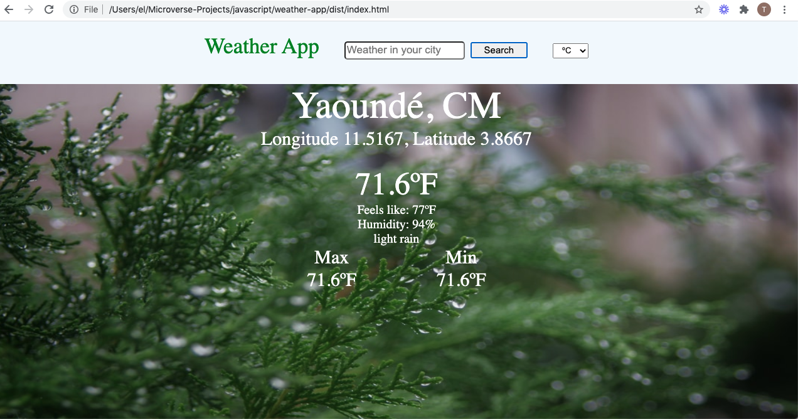

# Weather App

## Project Concept
A current weather check site were users can search by city. Weather data gathered from OpenWeatherMap.

## Project Screenshot


## Built With

- JavaScript
- HTML
- CSS
- Webpack
- APIs

## Live Demo
[Live Demo](https://raw.githack.com/t-yanick/weather-app/weather-app-workplace/dist/index.html)

## Getting Started

To get a local copy up and running follow these simple example steps.

# Instructions (Set Up)

Clone this repository in your computer
```
$  git clone https://github.com/t-yanick/weather-app.git
```
Run ```npm install``` in the terminal to install dependencies.

Run ```npm dev/build``` in the terminal to build

Run ```npm start``` and the site will open in the browser at ```localhost:8080```

## Generating necessary API keys

### Openweathermap API
- Open the URL `www.openweathermap.org`
- Create an account or signin if you already have an account.
- Navigate to API and generate an API key.
- In the project `src` directory, open `getdata.js` and insert the generated key `https://api.unsplash.com/photos/random?orientation=landscape&count=1&client_id=[Enter_generated_key_here]&query=${input}`

## Authors

👤 **Tazoh Yanick**

- Github: [@t-yanick](https://github.com/t-yanick)
- Twitter: [@ElTazoh](https://twitter.com/ElTazoh)
- LinkedIn: [Tazoh Yanick](https://linkedin.com/in/tazoh-yanick)

## 🤝 Contributing

Contributions, issues and feature requests are welcome!
Feel free to check the issues page.

## Show your support

Give a ⭐️ if you like this project!

## Acknowledgments

- [Microverse](https://www.microverse.org/).
- [The Odin Project](https://www.theodinproject.com/courses/javascript/lessons/weather-app).

## 📝 License

This project is [MIT licensed](https://mit.org).
